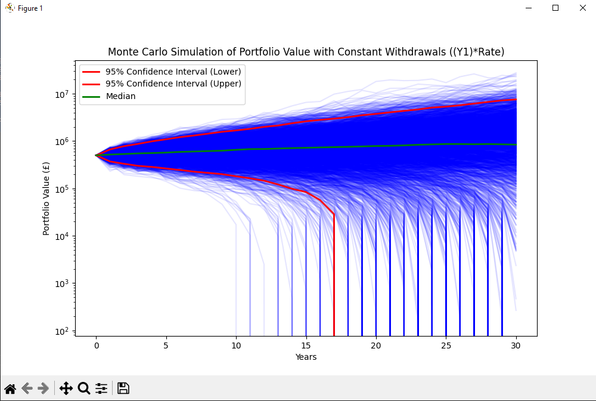

# Monte Carlo Portfolio Simulator

This Python program allows you to perform Monte Carlo simulations on a portfolio, providing insights into potential outcomes based on user-defined parameters.

**Warning: the values produced by the simulator are for illustrative purposes only.**

---

## Description

The Monte Carlo Portfolio Simulator enables users to analyze portfolio performance over time, taking into account factors such as:
- Portfolio value
- Annual returns
- Volatility
- Inflation rates
- Withdrawal rates

Customize the simulation with flexible options to suit your needs.

---
Note 1: when -s option is used or "Show plot" in the GUI is selected the
program will also calculate and plot
- the 95% confidence interval within two red lines
- the median portfolio value as a green line
- "Use log scale" option and "Show plot" option in the GUI are useful 
 to show if the portfolio can run out in year using the 95% confidence 
 interval.

Note 2: the summary is green when the portfolio is greater then the initial
value or peachpuff colour otherwise.

---

## How to Run

You can run the simulation in various shell environments. Here are the commands:

### How to run in various shell
- **PowerShell**:
Using PowerShell

python .\mc_portfolio_simulator.py

- **Dos**:
Using DOS shell

python mc_portfolio_simulator.py

- **Bash or Mac Terminal**:
Using bash or mac

python mc_portfolio_simulator.py 

### Script Arguments

Customize the simulation using these arguments:

| Argument            | Description                                                                            | Type      | Choices                        | Default Value |
|---------------------|----------------------------------------------------------------------------------------|-----------|--------------------------------|---------------|
| `-p`, `--portfolio_value` | Starting amount in the portfolio (e.g. `500000` for £500,000).                   | `int`     | N/A                            | `500000`      |
| `-m`, `--mean_return`     | Average annual return expected (choose from `0.06`, `0.07`, `0.08`, `0.09`).     | `float`   | `0.06`, `0.07`, `0.08`, `0.09` | `0.07`        |
| `-v`, `--volatility`      | Variation in annual returns due to market conditions (`0.15` or `0.16`).         | `float`   | `0.15`, `0.16`                 | `0.15`        |
| `-y`, `--years`           | Duration of the simulation in years (e.g. `30` for 30 years).                    | `int`     | N/A                            | `30`          |
| `-n`, `--nb_simulations`  | Total number of simulations to model potential outcomes (e.g. `1000`).           | `int`     | N/A                            | `3000`        |
| `-s`, `--show`            | Display the simulations.                                                         | `bool`    | N/A                            | `False`       |
| `-i`, `--inflation_rate`  | Historical average inflation rate (e.g. `0.039` for 3.9%).                       | `float`   | N/A                            | `0.039`       |
| `-d`, `--dynamic_withdraw`| Dynamic withdrawal: withdraw a percent of yearly portfolio.                      | `bool`    | N/A                            | `False`       |
| `-w`, `--withdrawal_rate` | Constant withdrawal rate (e.g. `0.03` for 3%).                                   | `float`   | N/A                            | `0.03`        |

---
## How to run the GUI

### Initial conditions: first simulation
python.exe .\mc_portfolio_simulator.py

```
        Portfolio initial value: £500000.0
                 Inflation rate: 3.90%
      Expected portfolio return: 7.00%
     Withdrawal amount per year: £15000.00
         Annual Withdrawal rate: 0.03
   Simulation duration in years: 30
```
The following screenshot shows  what the GUI looks like when start the application


In this particular run with 3000 simulations, inflation rate of 3.90%, a withdrawal of £15000 ajusted for inflation and an expected return of 7%. The portfolio survives the 30years with a probability of depletion of 21.17%.


### Results: first simulation
```
Withdrawal amount at first year: £15000
Without inflation
     Mean final portfolio value: £1648028.93
     Mean final portfolio value: £1648028.93
  Std Dev final portfolio value: £2246227.24
Inflation adjusted
     Mean final portfolio value: £522996.05
  Std Dev final portfolio value: £712832.13
Withdrawal amount at final year: £15000
 Probability of portfolio depletion before 30 years: 21.17%
```
### Initial conditions: second simulation
Same as before and tick
* Show plot
* Use log scale
```
        Portfolio initial value: £500000.0
                 Inflation rate: 3.90%
      Expected portfolio return: 7.00%
     Withdrawal amount per year: £15000.00
         Annual Withdrawal rate: 0.03
   Simulation duration in years: 30
```
The plot uses log scale and shows the following results with 95% confidence.
* The first red line shows that in bad luck the portfolio only lasted 17 years.
* The green show the median and that the portfolio survives
* The second shows the very lucky case when the portfolio survive and increase in value.



After closing the plot the result summary will appear.


### Results: second simulation

```
Withdrawal amount at first year: £15000
Without inflation
     Mean final portfolio value: £1652076.43
     Mean final portfolio value: £1652076.43
  Std Dev final portfolio value: £2303713.04
Inflation adjusted
     Mean final portfolio value: £524280.50
  Std Dev final portfolio value: £731075.04
Withdrawal amount at final year: £15000
 Probability of portfolio depletion before 30 years: 22.23%
```
## License
This project is licensed under the MIT License. See the full license text below.
```
MIT License

Copyright (c) 2025 pc-scylla

Permission is hereby granted, free of charge, to any person obtaining a copy of
this software and associated documentation files (the "Software"), to deal in
the Software without restriction, including without limitation the rights to
use, copy, modify, merge, publish, distribute, sublicense, and/or sell copies
of the Software, and to permit persons to whom the Software is furnished to do
so, subject to the following conditions:

The above copyright notice and this permission notice shall be included in all
copies or substantial portions of the Software.

THE SOFTWARE IS PROVIDED "AS IS", WITHOUT WARRANTY OF ANY KIND, EXPRESS OR
IMPLIED, INCLUDING BUT NOT LIMITED TO THE WARRANTIES OF MERCHANTABILITY, FITNESS
FOR A PARTICULAR PURPOSE AND NONINFRINGEMENT. IN NO EVENT SHALL THE AUTHORS OR
COPYRIGHT HOLDERS BE LIABLE FOR ANY CLAIM, DAMAGES OR OTHER LIABILITY, WHETHER
IN AN ACTION OF CONTRACT, TORT OR OTHERWISE, ARISING FROM, OUT OF OR IN
CONNECTION WITH THE SOFTWARE OR THE USE OR OTHER DEALINGS IN THE SOFTWARE.
```

*This README.md was generated with assistance from [Microsoft Copilot](https://www.microsoft.com/en-us/edge/microsoft-copilot).*  

